# Takım İsmi
- NextGen Healers

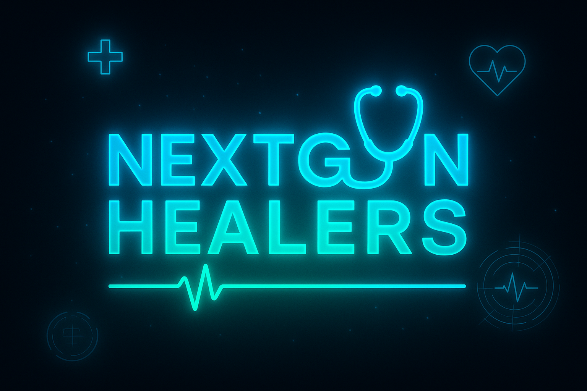

## 👥 Takım Üyeleri
- **Bedirhan Portakal** – Developer
- **Muhammed Uyğur** – Scrum Master
- **Ramazan Mert Özçelikbaş** - Product Owner
- **Tuana Zehra Erdoğan** – Developer
- **Zeynep Yıldız** – Developer

# Ürün İsmi

## Product Backlog URL
[Trello Panosu](https://trello.com/b/eOTahhcW)

## Ürün Açıklaması
Bu ürün, farklı meslek dallarındaki uzmanlara ve öğrencilere destek sağlayacak web tabanlı bir yapay zeka asistanı geliştirmeyi amaçlamaktadır. Sistem, kullanıcı olarak meslek uzmanlarının ve öğrencilerin kullanımına sunulacak ve danışan ya da hastaların sorunları, metin tabanlı (prompt) ya da sesli giriş yoluyla sisteme iletilecektir.
Gelen bilgiler ya da önerilen müdahaleler, ilgili uzmana aktarılacak ve uzmanın onayıyla müdahaleler danışana mail yoluyla iletilebilecek.

## Ürün Özellikleri
- 🗣️ Sesli ve Yazılı Girdi Desteği: Danışan veya hastaların sorunları, yazılı olarak (prompt) ya da sesli giriş şeklinde sisteme alınabilir.
- 🤖 Yapay Zeka Destekli Analiz: Alınan girdiler, yapay zeka (LLM) tarafından analiz edilerek uygun bilgi, yorum veya müdahale önerileri hazırlanır.
- 🔗 LangChain Entegrasyonu: LLM iş akışları, prompt yönetimi ve RAG süreçleri için kullanılacak.
- 📨 Uzman Onaylı İletim: AI tarafından üretilen müdahale veya çözüm önerileri, önce ilgili uzmana iletilir; uzman onayladıktan sonra danışana otomatik olarak e-posta yoluyla gönderilir.
- 🧠 Meslek Bazlı Yapay Zeka Promptları: Her meslek alanı için özel ayarlanmış yapay zeka davranışları veya yanıt yapıları ile çalışır.
- 🔐 Erişim Kontrolü: Her uzman sadece kendi danışanlarıyla ilgili verilere erişebilir.
- 📚 Danışan Geçmişi Kayıtları: Sistem, danışanlardan gelen geçmiş girişleri ve önceki müdahale önerilerini saklar, uzman gerektiğinde geçmişi inceleyebilir.

## Hedef Kitle
- Doktorlar ve sağlık danışmanları
- Psikologlar, psikolojik danışmanlar, terapistler
- Öğrenciler

## Kullanılan Teknolojiler
- FastAPI (Backend)
- HTML/CSS/JavaScript (Frontend)
- Gemini API (Yapay Zeka)
- LangChain (LLM yönetimi ve zincirleme yapı)
- SQLite (Veritabanı)
- PyJWT (Authentication & JWT Token)
- Pydantic (Veri validasyonu)
- Jinja2 (Template Engine)
- Prompt Engineering (Özelleştirilmiş ve rol bazlı yönlendirmeler)
- Trello (Proje Yönetimi)

# 📊 Sprint 1

## Sprint Notları
Sprint 1'de temel sistem altyapısı ve MVP (Minimum Viable Product) özellikleri geliştirilmiştir. Kullanıcı yönetimi, hasta kayıt sistemi ve temel AI konsültasyon özellikleri başarıyla tamamlanmıştır.

## Bu Sprint İçinde Tahmin Edilen Tamamlanacak Puan
**Toplam Puan: 100**

### Tamamlanan User Story'ler:
- **Kullanıcı Kayıt ve Giriş Sistemi** (20 puan) ✅
- **Hasta Kayıt ve Yönetim Sistemi** (25 puan) ✅  
- **Temel AI Konsültasyon Sistemi** (15 puan) ✅
- **Web Arayüzü Tasarımı** (15 puan) ✅
- **Veritabanı Yapısı** (15 puan) ✅
- **Ürüne İsim Bulma** (5 puan) ✅
- **Takıma İsim Bulma** (5 puan) ✅

## Puan Tamamlama Mantığı
- **Kompleksite Değerlendirmesi**: 
  - 1-5: Basit görevler (Basit görevler)
  - 6-15: Orta görevler (API endpoint'leri, veritabanı işlemleri)
  - 16-25: Karmaşık görevler (Authentication, AI entegrasyonu)

## Daily Scrum: WhatsApp üzerinden gerçekleştirilmiştir.

🗂️ [**Daily Scrum Görüntüleri (ZIP)**](<imagess/daily-scrum-images.zip>) - *1.2MB*

## Sprint Board Update

## Ürün Durumu ScreenShots

## Sprint Review
### Tamamlanan Özellikler:
1. **FastAPI Backend Altyapısı**
   - Authentication sistemi (JWT token)
   - Hasta CRUD işlemleri
   - AI konsültasyon endpoint'i
   
2. **Frontend Arayüzü**
   - Responsive web tasarımı
   - Kullanıcı kayıt/giriş sayfaları
   - Hasta yönetim paneli
   - AI asistan chat arayüzü

3. **Veritabanı**
   - SQLite ile kullanıcı ve hasta tabloları
   - İlişkisel veritabanı yapısı

4. **AI Entegrasyonu**
   - Google Gemini API entegrasyonu
   - Meslek dalına göre özelleştirilmiş promptlar
   - Nöroloji ve Dermatoloji uzmanlaşması
   - Langchain entegrasyonu

## Sprint Retrospective

### İyi Giden Şeyler:
- FastAPI uygulama süreci hızlı oldu
- AI entegrasyonu beklenenden kolay gerçekleşti
- Veritabanı tasarımı başarılı
- Frontend tasarımı modern ve kullanışlı

### Geliştirilmesi Gerekenler:
- LangChain entegrasyonu geliştirilecek
- Sesli giriş özelliği eksik
- E-posta gönderimi sistemi henüz yok
- Yeni fonksiyonlar eklenecek
- Gerekliyse yeni sayfalar eklenecek

### Öğrenilenler:
- Gemini API'nin güçlü olduğu ancak prompt engineering'in önemli olduğu
- FastAPI'nin hızlı prototip geliştirme için mükemmel olduğu
- SQLite'ın development aşaması için yeterli olduğu
- JWT authentication'ın güvenli ve kolay uygulanabilir olduğu

# 📊 Sprint 2

## Sprint Notları
Sprint 2'de sistem üzerinde önemli iyileştirmeler ve yeni özellikler geliştirilmiştir. Langchain ile AI memory eklenmiştir, hastanın tüm soru-cevap geçmişinin kayıt edilmesi gerçekleşmiştir, hastanın TC nosu yerine doğum tarihi bilgileri değişikliği yapılmıştır, hasta kayıt sisteminde ek olarak e-posta bilgisi eklenmiştir, prompt engineering geliştirilmiştir, db tabloları güncellenmiştir, profesyonel sayfa tasarımları yapılmış ve AI ile sesli giriş sistemi entegre edilmiştir.

## Bu Sprint İçinde Tahmin Edilen Tamamlanacak Puan
**Toplam Puan: 100**

### Tamamlanan User Story'ler:
- **Langchain AI Memory Entegrasyonu** (20 puan) ✅
- **Hasta Soru-Cevap Geçmişi Kayıt Sistemi** (10 puan) ✅  
- **Hasta Kayıt Sistemi Güncellemeleri** (10 puan) ✅
- **Prompt Engineering Geliştirmeleri** (15 puan) ✅
- **Veritabanı Tablo Güncellemeleri** (10 puan) ✅
- **Profesyonel Sayfa Tasarımları** (15 puan) ✅
- **AI Sesli Giriş Sistemi Entegrasyonu** (20 puan) ✅

## Puan Tamamlama Mantığı
- **Kompleksite Değerlendirmesi**: 
  - 1-10: Basit görevler 
  - 11-15: Orta görevler 
  - 16-20: Karmaşık görevler 

## Daily Scrum: WhatsApp üzerinden gerçekleştirilmiştir.

[Bağlantı metni](https://drive.google.com/drive/folders/1lwllg_h4R7DX_PBcP5aGkxQG-hdn_Oet?usp=sharing)

## Sprint Board Update
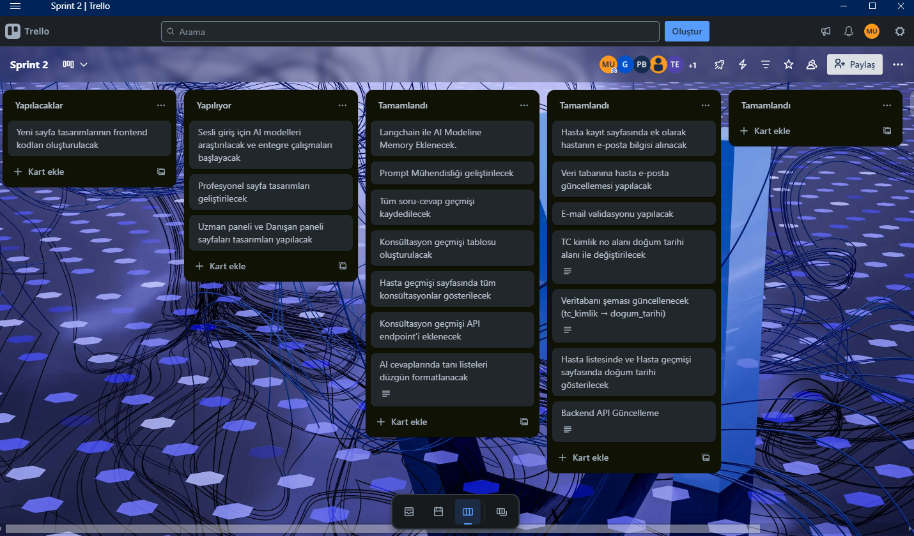
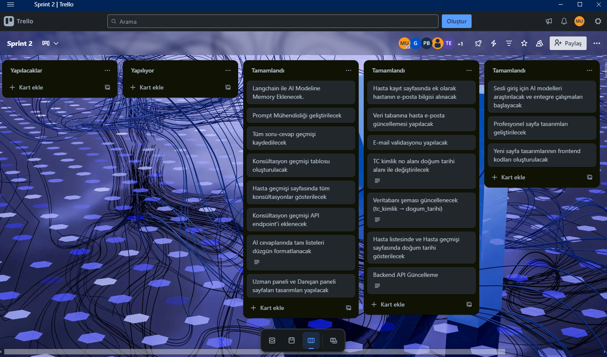

## Ürün Durumu ScreenShots

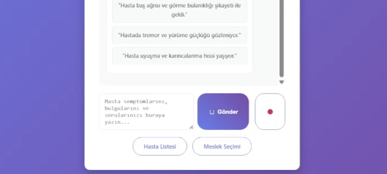
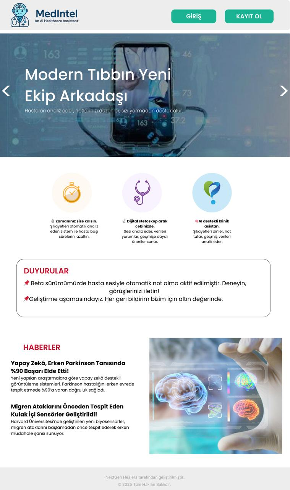
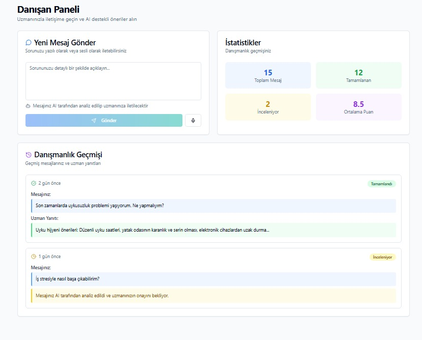
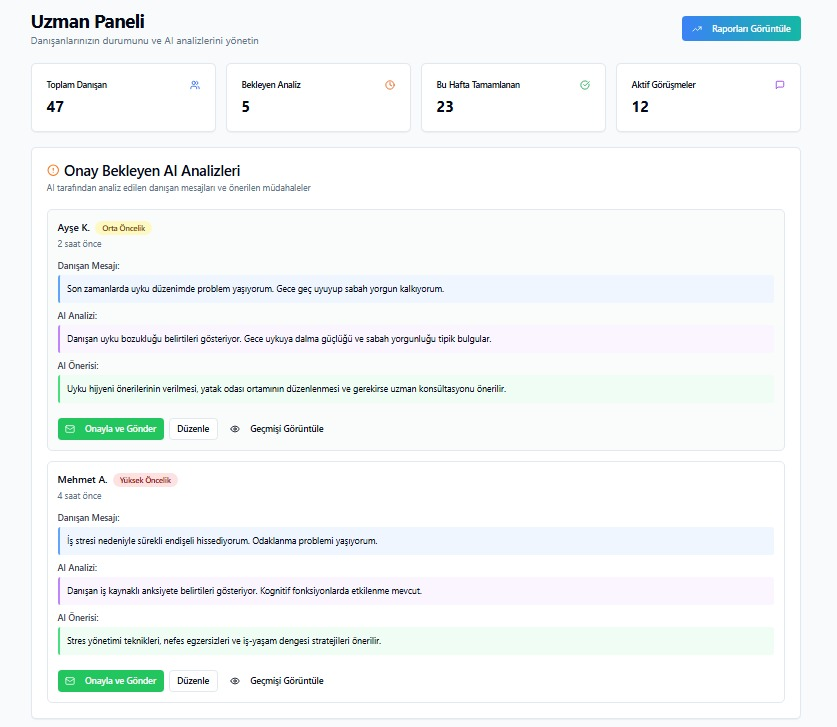
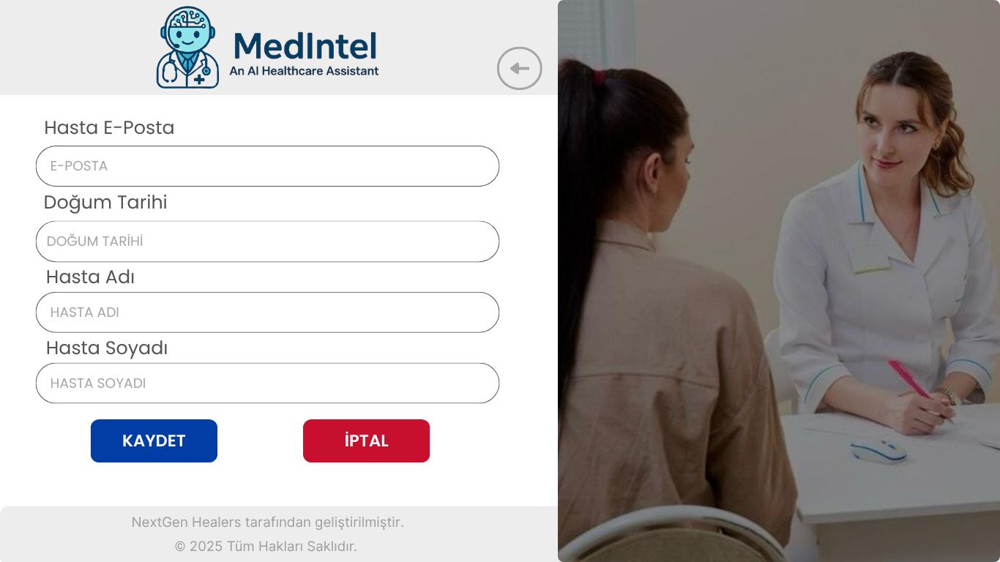

## Sprint Review
### Tamamlanan Özellikler:
1. **Langchain AI Memory Entegrasyonu**
   - LangChain framework entegrasyonu
   - Konuşma hafızası sistemi
   - Bağlamsal soru-cevap devamlılığı
   - Gelişmiş AI yanıt kalitesi
   
2. **Hasta Soru-Cevap Geçmişi Kayıt Sistemi**
   - Tüm konsültasyon geçmişi veritabanında saklanıyor
   - Hasta bazlı geçmiş görüntüleme
   - Soru-cevap eşleştirme sistemi
   - Geçmiş analiz ve takip imkanı

3. **Hasta Kayıt Sistemi Güncellemeleri**
   - TC kimlik numarası yerine doğum tarihi bilgisi
   - E-posta adresi zorunlu alan olarak eklendi
   - Gelişmiş hasta profil yönetimi
   - Veri doğrulama sistemleri

4. **Prompt Engineering Geliştirmeleri**
   - Daha etkili AI yönlendirme sistemleri
   - Meslek dalına özel prompt optimizasyonları
   - Yanıt kalitesi iyileştirmeleri

5. **Veritabanı Tablo Güncellemeleri**
   - Hasta tablosu yapısal değişiklikler
   - Yeni alan eklemeleri ve indekslemeler

6. **Profesyonel Sayfa Tasarımları**
   - Modern ve kullanıcı dostu arayüz tasarımı
   - Gelişmiş UX/UI deneyimi
   - Marka kimliği entegrasyonu

7. **AI Sesli Giriş Sistemi Entegrasyonu**
   - Konuşma tanıma teknolojisi entegrasyonu
   - Sesli komut işleme sistemi
   - Metin-konuşma dönüştürme özelliği

## Sprint Retrospective

### İyi Giden Şeyler:
- LangChain entegrasyonu AI performansını önemli ölçüde artırdı
- Hasta soru-cevap geçmişi takibi sistem değerini yükseltti
- TC numarası yerine doğum tarihi kullanımı veri güvenliğini artırdı
- E-posta alanı eklenmesi iletişim imkanlarını genişletti
- Prompt engineering geliştirmeleri daha kaliteli yanıtlar sağladı
- Profesyonel tasarım kullanıcı deneyimini iyileştirdi
- Sesli giriş sistemi sistemin erişilebilirliğini artırdı

### Geliştirilmesi Gerekenler:
- E-posta bildirim sistemi daha da geliştirilecek
- RAG sistemi entegrasyonu tamamlanacak
- Daha fazla meslek dalı eklenecek
- Raporlama ve analitik özellikler geliştirilecek
- Çoklu dil desteği eklenebilir

### Öğrenilenler:
- LangChain'in konuşma hafızası konusundaki gücü anlaşıldı
- Hasta geçmişi takibinin klinik değeri kavrandı
- Veri güvenliği ve mahremiyetin önemi vurgulandı
- Prompt engineering'in AI kalitesine doğrudan etkisi gözlemlendi
- Sesli arayüzün kullanıcı deneyimindeki rolü anlaşıldı
- Veritabanı yapısının esnekliğinin önemi kavrandı
- Profesyonel tasarımın güven oluşturmadaki etkisi görüldü

# 📊 Sprint 3

## Sprint Notları
Sprint 3'te sistem üzerinde kapsamlı geliştirmeler ve yeni özellikler eklenmiştir. RAG (Retrieval-Augmented Generation) sistemi tam entegrasyonu gerçekleştirilmiştir, AI sağlık haberleri sistemi eklenmiştir, admin paneli ve RAG yönetim arayüzü geliştirilmiştir, kullanıcı hesap ayarları ve profil yönetimi sistemi eklenmiştir, veritabanı yapısı genişletilmiştir, güvenlik önlemleri artırılmıştır ve sistem performansı optimize edilmiştir. Uzman paneli sayfaları entegresi geliştirme aşamasına bırakılmıştır. 

## Bu Sprint İçinde Tahmin Edilen Tamamlanacak Puan
**Toplam Puan: 100**

### Tamamlanan User Story'ler:
- **RAG Sistemi Tam Entegrasyonu** (25 puan) ✅
- **AI Sağlık Haberleri Sistemi** (15 puan) ✅  
- **Admin Panel ve RAG Yönetim Arayüzü** (20 puan) ✅
- **Kullanıcı Hesap Ayarları ve Profil Yönetimi** (15 puan) ✅
- **Veritabanı Yapısı Genişletme** (10 puan) ✅
- **Docker Containerization ve Deployment** (10 puan) ✅
- **Sistem Performans Optimizasyonu** (5 puan) ✅

## Puan Tamamlama Mantığı
- **Kompleksite Değerlendirmesi**: 
  - 1-10: Basit görevler 
  - 11-15: Orta görevler 
  - 16-25: Karmaşık görevler 

## Daily Scrum: WhatsApp üzerinden gerçekleştirilmiştir.

[Bağlantı metni](https://drive.google.com/drive/folders/1E73AgaLtTcYYkRNrP4ZHfv20VyfhWtTd?usp=sharing)

## Sprint Board Update
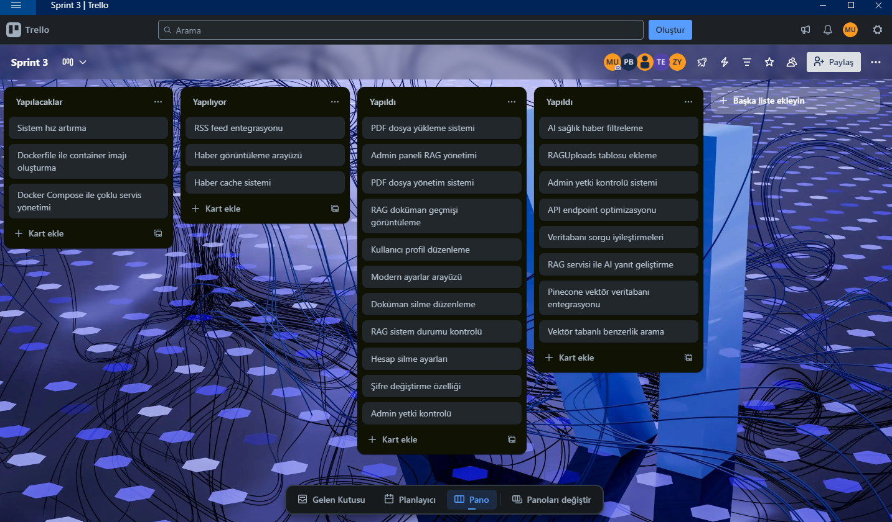
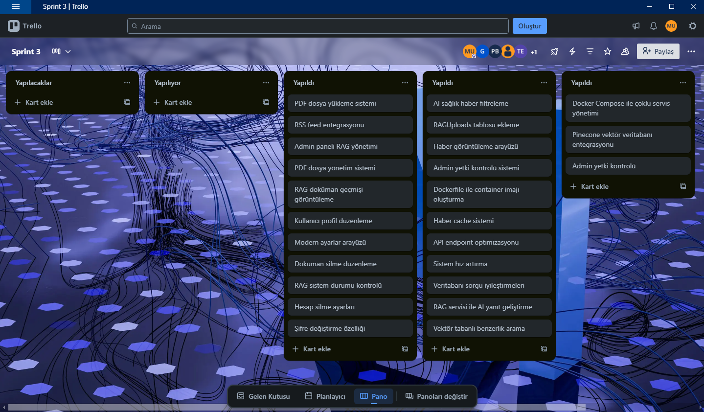

## Ürün Durumu ScreenShots

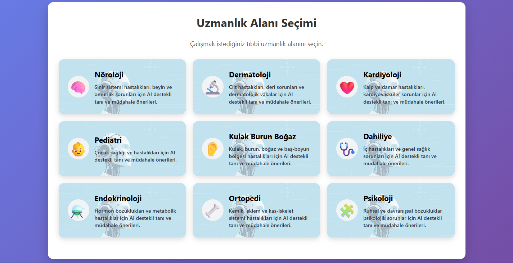

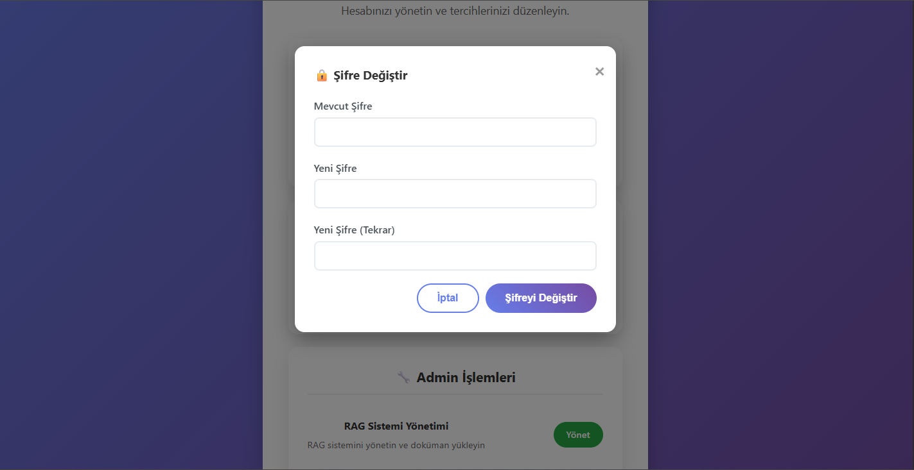
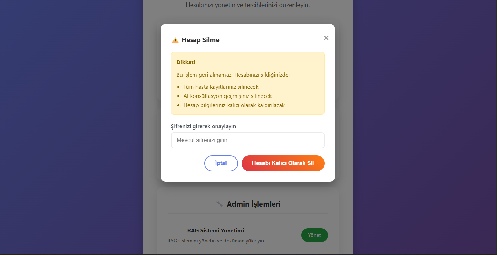
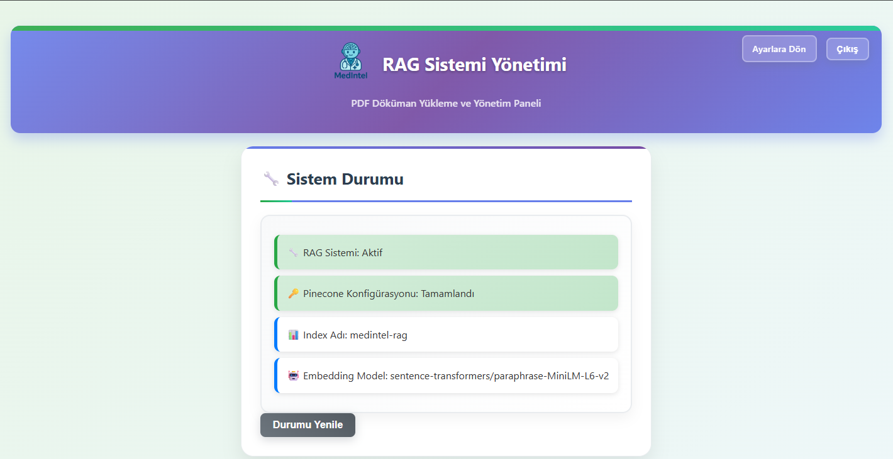
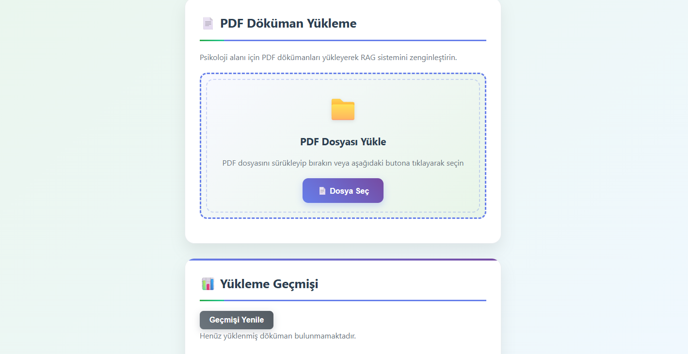
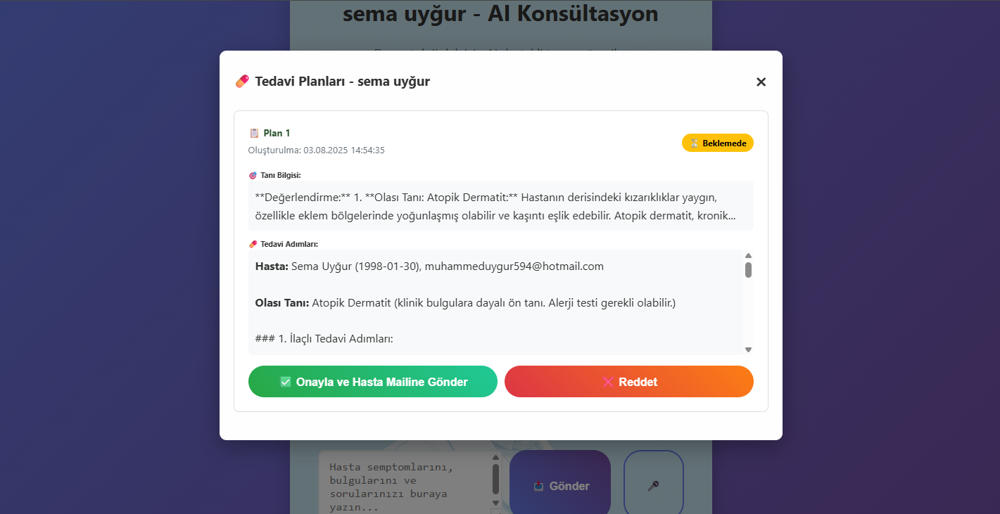
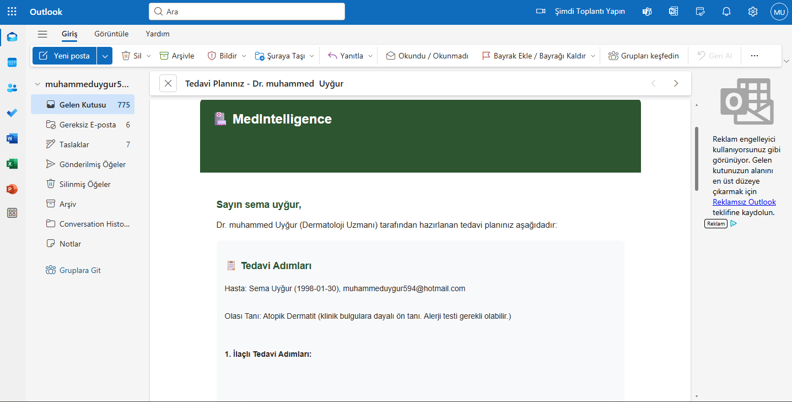
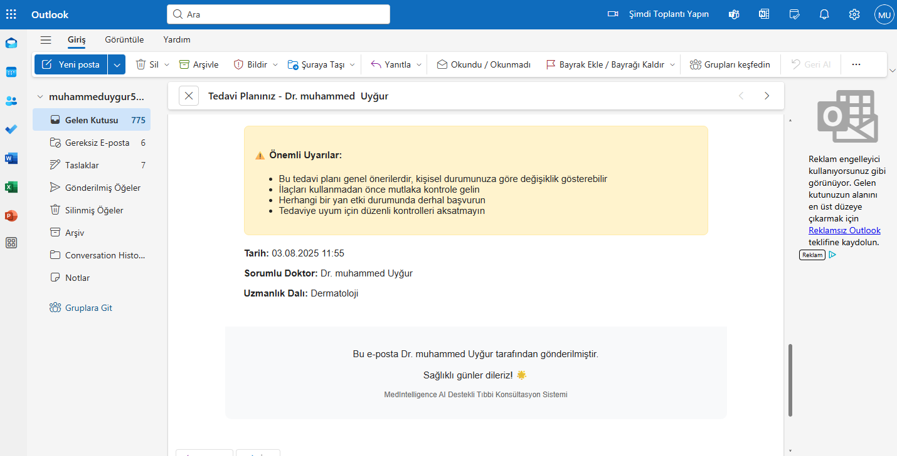

## Sprint Review
### Tamamlanan Özellikler:
1. **RAG Sistemi Tam Entegrasyonu**
   - Pinecone vektör veritabanı entegrasyonu
   - PDF dosya yükleme ve işleme sistemi
   - Vektör tabanlı benzerlik arama
   - RAG servisi ile AI yanıtlarının geliştirilmesi
   - Admin paneli üzerinden RAG yönetimi
   
2. **AI Sağlık Haberleri Sistemi**
   - RSS feed entegrasyonu ile otomatik haber çekme
   - AI ve sağlık alanında filtreleme sistemi
   - Haber cache sistemi ve performans optimizasyonu
   - Kullanıcı dostu haber görüntüleme arayüzü

3. **Admin Panel ve RAG Yönetim Arayüzü**
   - PDF dosya yükleme ve yönetim sistemi
   - RAG doküman geçmişi görüntüleme
   - Doküman silme ve düzenleme özellikleri
   - RAG sistem durumu kontrolü
   - Admin yetki kontrolü ve güvenlik

4. **Kullanıcı Hesap Ayarları ve Profil Yönetimi**
   - Kullanıcı profil düzenleme sistemi
   - Şifre değiştirme özelliği
   - Hesap silme ayarları
   - Modern ve kullanıcı dostu ayarlar arayüzü

5. **Veritabanı Yapısı Genişletme**
   - RAGUploads tablosu eklendi
   - TreatmentPlans tablosu genişletildi
   - Yeni ilişkiler ve indeksler eklendi
   - Veritabanı performans optimizasyonu

6. **Docker Containerization ve Deployment**
   - Dockerfile ile container imajı oluşturma
   - Docker Compose ile çoklu servis yönetimi
   - Production-ready deployment konfigürasyonu

7. **Sistem Performans Optimizasyonu**
   - Haber cache sistemi
   - RAG sorgu optimizasyonu
   - Veritabanı sorgu iyileştirmeleri
   - Frontend performans optimizasyonları

## Sprint Retrospective

### İyi Giden Şeyler:
- RAG sistemi başarıyla entegre edildi ve AI yanıt kalitesi önemli ölçüde artırıldı
- AI sağlık haberleri sistemi kullanıcılara güncel bilgi sağladı
- Admin paneli ile sistem yönetimi kolaylaştı
- Kullanıcı hesap ayarları sistemi kullanıcı deneyimini iyileştirdi
- Veritabanı yapısı genişletildi ve performans artırıldı
- Docker containerization ile deployment süreci kolaylaştı
- Güvenlik önlemleri artırıldı ve sistem güvenilirliği yükseltildi
- Sistem performansı optimize edildi ve hız artırıldı
- MVP tamamlandı. 

### Geliştirilmesi Gerekenler:
- Daha fazla meslek dalı için RAG dokümanları eklenebilir
- Haber sistemi daha fazla kaynak ile genişletilebilir
- Kullanıcı raporlama ve analitik özellikleri geliştirilebilir
- Mobil uygulama geliştirilebilir
- Psikoloji için hasta isim soyisim yerine takma ad kaydedilmesi
- Uzman paneli entegre edilebilir.

### Öğrenilenler:
- RAG sisteminin AI yanıt kalitesine olan etkisi anlaşıldı
- Vektör veritabanlarının gücü ve kullanım alanları kavrandı
- RSS feed entegrasyonunun haber sistemleri için önemi görüldü
- Admin paneli tasarımının sistem yönetimi için kritik olduğu anlaşıldı
- Kullanıcı hesap yönetiminin kullanıcı deneyimindeki rolü kavrandı
- Docker containerization'ın deployment süreçlerini kolaylaştırdığı görüldü
- Production-ready deployment konfigürasyonunun önemi anlaşıldı
- Ürün elde etmenin getirdiği pozitif duygular anlaşıldı.

