# 🧠 Takım İsmi: 

## 👥 Takım Üyeleri
- **Bedirhan Portakal** – Developer
- **Muhammed Uyğur** – Scrum Master
- **Ramazan Mert Özçelikbaş** - Product Owner
- **Tuana Zehra Erdoğan** – Developer
- **Zeynep Yıldız** – Developer

## 🤖 Ürün İsmi

## 📋 Product Backlog URL
[Trello Panosu](https://trello.com/b/eOTahhcW)

## 📝 Ürün Açıklaması
Bu ürün, farklı meslek dallarındaki uzmanlara ve öğrencilere destek sağlayacak web tabanlı bir yapay zeka asistanı geliştirmeyi amaçlamaktadır. Sistem, kullanıcı olarak meslek uzmanlarının ve öğrencilerin kullanımına sunulacak ve danışan ya da hastaların sorunları, metin tabanlı (prompt) ya da sesli giriş yoluyla sisteme iletilecektir.
Gelen bilgiler ya da önerilen müdahaleler, ilgili uzmana aktarılacak ve uzmanın onayıyla müdahaleler danışana mail yoluyla iletilebilecek.

## ⚙️ Ürün Özellikleri
- 🗣️ Sesli ve Yazılı Girdi Desteği: Danışan veya hastaların sorunları, yazılı olarak (prompt) ya da sesli giriş şeklinde sisteme alınabilir.
- 🤖 Yapay Zeka Destekli Analiz: Alınan girdiler, yapay zeka (LLM) tarafından analiz edilerek uygun bilgi, yorum veya müdahale önerileri hazırlanır.
- 🔗 LangChain Entegrasyonu: LLM iş akışları, prompt yönetimi ve RAG süreçleri için kullanılacak.
- 📨 Uzman Onaylı İletim: AI tarafından üretilen müdahale veya çözüm önerileri, önce ilgili uzmana iletilir; uzman onayladıktan sonra danışana otomatik olarak e-posta yoluyla gönderilir.
- 🧠 Meslek Bazlı Yapay Zeka Promptları: Her meslek alanı için özel ayarlanmış yapay zeka davranışları veya yanıt yapıları ile çalışır.
- 🔐 Erişim Kontrolü: Her uzman sadece kendi danışanlarıyla ilgili verilere erişebilir.
- 📚 Danışan Geçmişi Kayıtları: Sistem, danışanlardan gelen geçmiş girişleri ve önceki müdahale önerilerini saklar, uzman gerektiğinde geçmişi inceleyebilir.

## 🎯 Hedef Kitle
- Psikologlar, psikolojik danışmanlar, terapistler
- Doktorlar ve sağlık danışmanları
- Öğrenciler

## 🛠️ Kullanılan Teknolojiler
- FastAPI (Backend)
- React (Frontend)
- Gemini API (Yapay Zeka)
- LangChain (LLM yönetimi ve zincirleme yapı)
- RAG (Retrieval-Augmented Generation mimarisi)
- Prompt Engineering (Özelleştirilmiş ve rol bazlı yönlendirmeler)
- Pinecone (Vector Veritabanı)
- Trello (Proje Yönetimi)
- Docker (Dağıtım)

# 📊 Sprint 1

## Sprint Notları
Sprint 1'de temel sistem altyapısı ve MVP (Minimum Viable Product) özellikleri geliştirilmiştir. Kullanıcı yönetimi, hasta kayıt sistemi ve temel AI konsültasyon özellikleri başarıyla tamamlanmıştır.

## Bu Sprint İçinde Tahmin Edilen Tamamlanacak Puan
**Toplam Puan: 100**

### Tamamlanan User Story'ler:
- **Kullanıcı Kayıt ve Giriş Sistemi** (20 puan) ✅
- **Hasta Kayıt ve Yönetim Sistemi** (25 puan) ✅  
- **Temel AI Konsültasyon Sistemi** (15 puan) ✅
- **Web Arayüzü Tasarımı** (15 puan) ✅
- **Veritabanı Yapısı** (15 puan) ✅
- **Ürüne İsim Bulma** (5 puan) ✅
- **Takıma İsim Bulma** (5 puan) ✅

## Puan Tamamlama Mantığı
- **Kompleksite Değerlendirmesi**: 
  - 1-5: Basit görevler (Basit görevler)
  - 6-15: Orta görevler (API endpoint'leri, veritabanı işlemleri)
  - 16-25: Karmaşık görevler (Authentication, AI entegrasyonu)

## Daily Scrum: WhatsApp üzerinden gerçekleştirilmiştir.

🗂️ [**Daily Scrum Görüntüleri (ZIP)**](<imagess/daily-scrum-images.zip>) - *1.2MB*

## Sprint Board Update
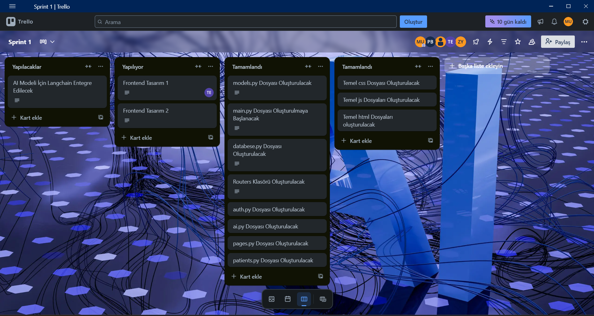
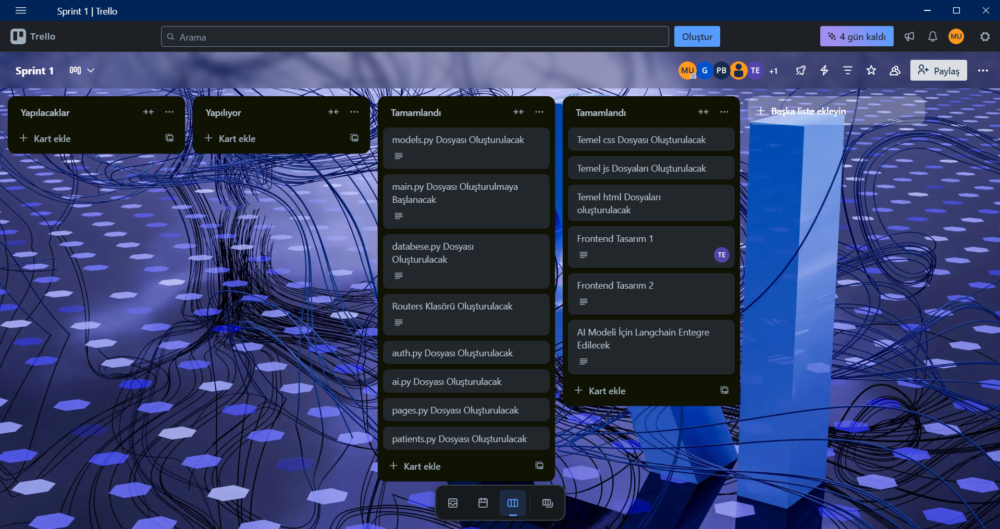

## Ürün Durumu ScreenShots

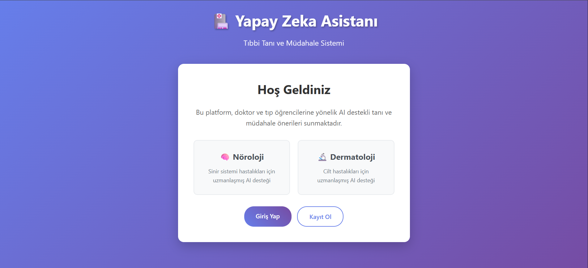
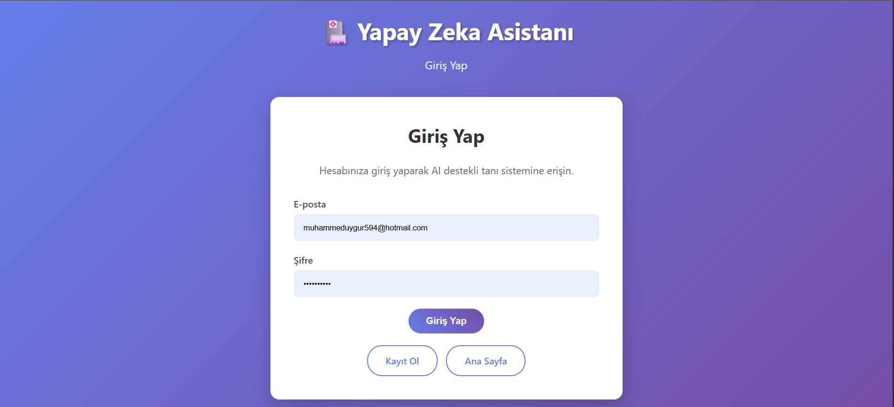
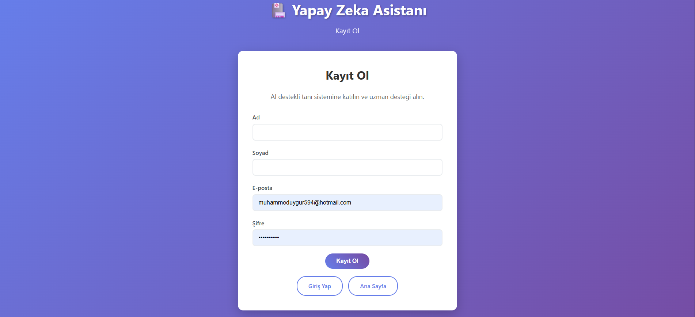
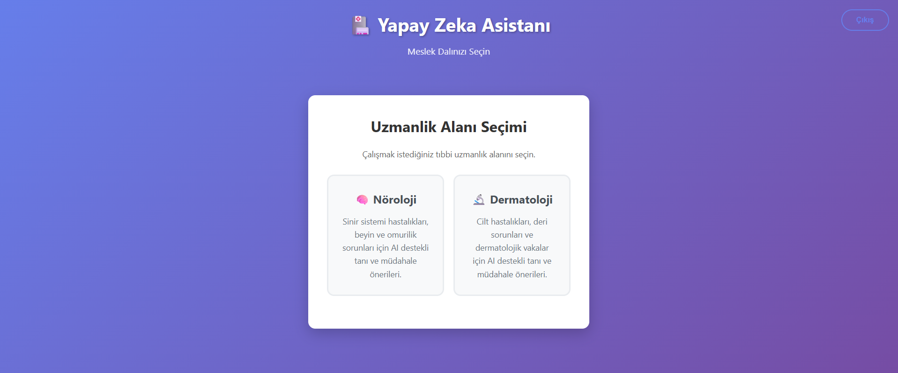
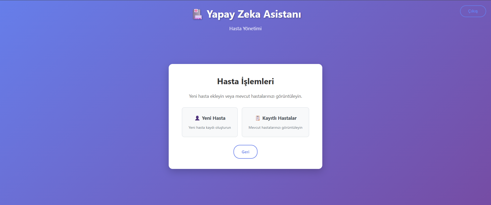
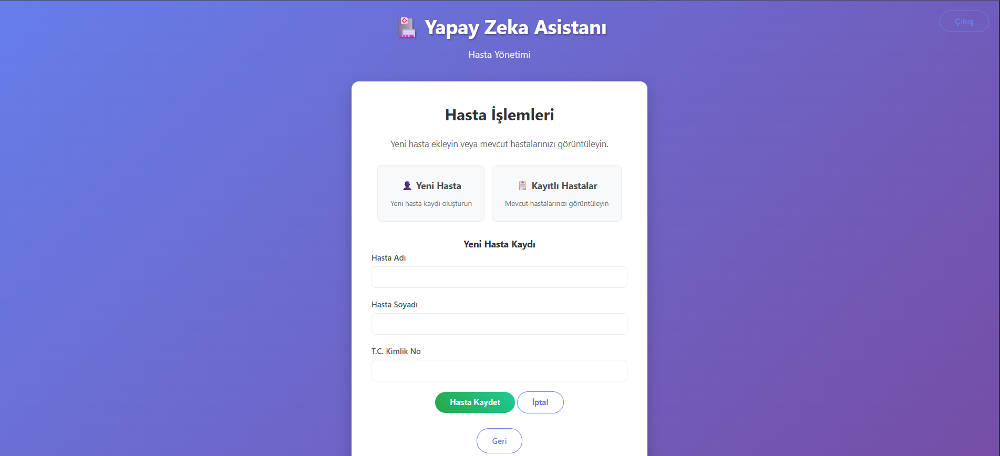
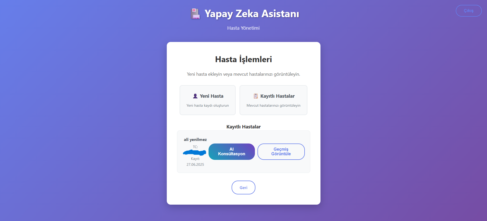
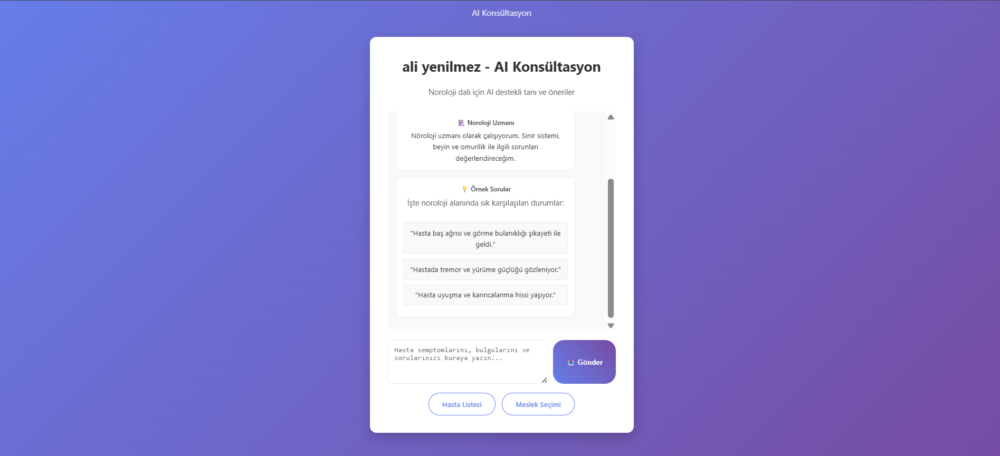
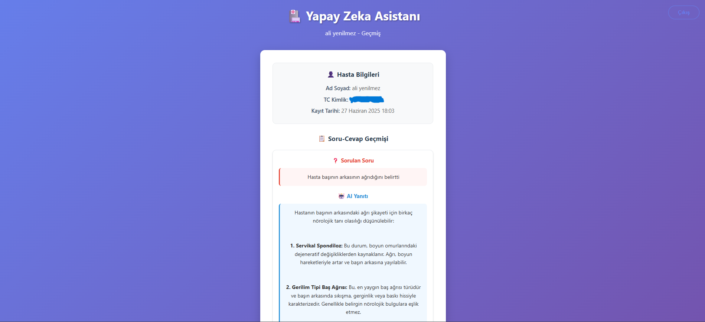
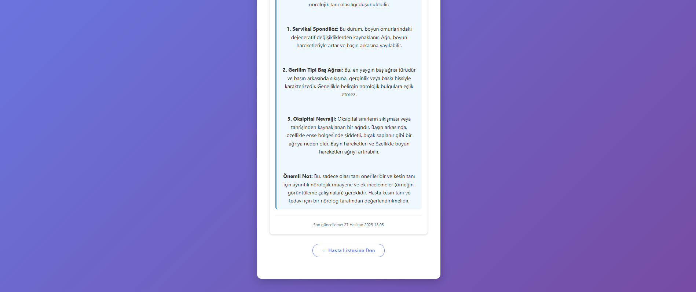
